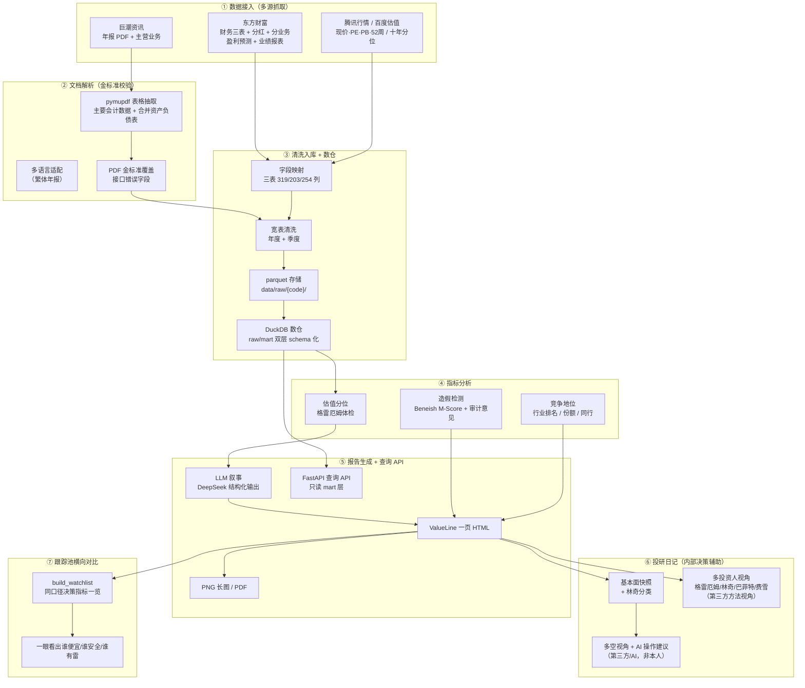

# AI 增强的基本面投研

面向 **A 股 + 港股**的**纯客观投研数据工具**：从多源数据接入、财报文档解析、数据清洗入库、DuckDB 数仓、基本面指标分析，到 LLM 驱动的 ValueLine 一页报告与**财务造假/风险检测（排雷）**，全链路自动化。

> 这是一个真实在跑的个人投研系统。**报告零「本人」观点**（无本人目标价、多空、买卖建议），专注「数据加工 + 风险检测」，**第三方机构的多空/评级观点照常保留**（客观数据）。核心目的是帮自己做投资决策前先排雷。核心方法论：格雷厄姆流派（安全边际 / 财务稳健）+ 彼得·林奇六类公司分类。

## 数据管道全链路



## 技术能力清单

| 能力 | 实现 | 状态 |
|------|------|------|
| **多源数据接入** | AKShare 封装东财 / 巨潮 / 腾讯 / 百度 / 经济通，覆盖 A 股 + 港股（财务三表、分红、分业务、估值、行情、机构评级、竞争地位、主营业务） | ✅ |
| **文档解析** | 巨潮年报 PDF + pymupdf `find_tables` 抽取「主要会计数据」「合并资产负债表」，支持繁体多语言；XBRL 公开链路已调研 | ✅ |
| **数据质量校验** | 官方年报 PDF 作金标准，逐字段对比（容差 <0.1%），异常字段自动覆盖；Beneish M-Score + 现金流背离 + 应收背离 + 审计意见（非标一票否决） | ✅ |
| **数仓设计** | DuckDB 列式数仓（raw/mart 双层 schema 化），`warehouse.py` 从 parquet 宽表落库，供分析查询与 API 直读 | ✅ |
| **定时调度** | macOS 原生 **launchd**（`scripts/com.fqf.daily-refresh.plist`）：每交易日 16:30 拉起日更（行情/估值/评级快照 → 估值板块轻量重刷 → 首页重生成）；`RunAtLoad` 保证关机/睡眠错过后的补跑，`.last_success` 闸门防重复执行 | ✅ |
| **LLM 应用层** | DeepSeek 结构化输出（JSON schema 约束），生成商业模式 / 投资逻辑 / 风险 / 林奇分类；铁律「只翻译数据，不编数」 | ✅ |
| **后端服务** | FastAPI 查询 API（7 端点），只读 DuckDB mart 层，参数化查询 + 指标白名单防注入 | ✅ |
| **全市场覆盖** | 全市场标的索引（A 股 5565 + 港股 2803 = **8368 只**，秒级可查）+ 全市场行情快照（**8368 只 / 25.8 秒 / 0 失败**）；财报按需拉取，覆盖范围不受"预拉过什么"限制 | ✅ |
| **报告交付** | ValueLine 一页 HTML → PNG @2x 长图 / PDF（Playwright） | ✅ |
| **报告产品服务** | FastAPI 产品层：输入代码或名称 → 一页报告（按需取数 + 进度轮询 + 缓存命中 0.5s），手机同 WiFi 可访问 | ✅ |

## 目录结构

```
.
├── src/
│   ├── data/          # 数据层：fetcher（拉取）/ cleaner（清洗）/ fields（字段映射）/ adapter（宽表→模板）/ storage（入库）/ warehouse（DuckDB 数仓落库）/ market_index（全市场标的索引）
│   ├── analysis/      # 分析层：fraud（Beneish M-Score + 现金流/应收背离 + 审计意见）
│   ├── report/        # 报告层：llm（DeepSeek 叙事，结构化输出）+ perspectives（多投资人视角定义）
│   ├── validation/    # 数据验证：cninfo（巨潮下载）/ pdf_parser（pymupdf）/ validator（金标准交叉校验）/ whitelist
│   ├── api/           # 后端数据 API：query（DuckDB 只读查询）/ main（FastAPI 7 端点）
│   └── review/        # 投研决策辅助：lynch（林奇六类 → 该看什么指标映射）
├── scripts/
│   ├── fetch_stock.py     # 拉取单票数据
│   ├── build_market_index.py  # 构建全市场标的索引（A 股 + 港股 8368 只）
│   ├── update_spot_all.py     # 全市场行情日更（8368 只 / 25.8s，日度）
│   ├── update_financials.py   # 财报更新（按需 / 观察池 / 全市场，季度）
│   ├── build_valueline.py # 渲染 ValueLine 一页报告
│   ├── build_web_index.py # 生成手机网页版首页（数据驱动）
│   ├── build_watchlist.py # 生成跟踪池横向对比表（同口径决策指标一览）
│   ├── export.py          # HTML → PNG / PDF
│   └── journal.py         # 投研日记（内部操作层，含 AI 操作建议）
├── tests/                     # 测试套件（单元 + 集成）
│   ├── test_cleaner.py        # 清洗层（银行股兼容 / 净利率兜底 / 派生指标）
│   ├── test_fraud.py          # 造假检测（M-Score / 审计意见非标一票否决）
│   ├── test_pdf_parser.py     # PDF 金标准三表解析（利润/现金流/资产负债）
│   ├── test_lynch.py          # 林奇六类分类 + 指标映射
│   └── test_warehouse.py      # 数仓层（datetime 归一化 / 跨股票 concat）
├── templates/valueline.html   # 报告模板（由 build_valueline.py 生成）
├── docs/
│   ├── architecture.md        # 架构设计
│   ├── data-map.md            # 数据地图：数据在哪 / 谁在跑 / 怎么更新（先读这个）
│   ├── data-validation.md     # 数据校验体系（四层防线 + 分层调度：金标准/结构断言/造假/告警）
│   ├── api.md                 # 查询 API 文档
│   ├── api-test-evidence.md   # 接口实测证据（7 端点全通）
│   ├── mobile-web.md          # 手机网页版部署（伪小程序）
│   ├── full-market.md         # 全市场覆盖：三层架构（索引/行情/财报）+ 日度季度更新 + 产品服务
│   ├── perspective-distillation.md  # 视角蒸馏 SOP（读书→视角 JSON→投研日记流水线）
│   └── decision-drill.md       # 决策演练 SOP（数据→三问定调→逼问矛盾→落纪律）
├── sql/
│   └── schema_raw.sql         # raw 层完整 DDL（DuckDB 方言，11 表 226 列，脚本自动生成）
├── data/                      # 本地数据缓存（gitignore，不提交，含 warehouse/fqf.duckdb 与 market/ 全市场索引·行情）
├── reports/                   # 报告归档（按季度）
├── web/                       # 产品层：server.py（FastAPI 报告服务）+ query.html（手机查询页）+ index.html（网页版入口）
├── watchlist/                 # 跟踪池（客观研究范围）
└── README.md
```

## 全市场覆盖与数据更新（2026-09-17）

从「跟踪池 8 只」扩展到「全市场 A 股 + 港股 8368 只」，架构分三层（**磁盘便宜、行情便宜、财报昂贵**）：

```
L0 索引层   8368 只标的（代码/名称/交易所）        秒级可查   每周构建
L1 行情层   8368 只行情快照（价/PE/PB/市值）       25.8s      每交易日
L2 财报层   单标的财报 + 一页报告                   约 4 分钟   按需触发 / 每季度全量
```

> 下面的 `python` 指项目 venv 解释器 —— 本机终端没有 `python` 命令，先定义 `$V`（见 [快速上手](#快速上手)）。

```bash
# 每周：重建标的索引（约 50s）
python scripts/build_market_index.py

# 每交易日：全市场行情快照（25.8s / 8368 只 / 0 失败）
python scripts/update_spot_all.py

# 每季度：补全市场财报（按需只补缺的；全量用 --scope all 跑一夜）
python scripts/update_financials.py --scope missing

# 随时：起服务，手机同 WiFi 打开 http://<内网IP>:8000 输入代码或名称出报告
python -m uvicorn web.server:app --host 0.0.0.0 --port 8000
```

关键设计取舍与踩坑记录见 **[docs/full-market.md](docs/full-market.md)**（含实测耗时、网络出口、
北交所 `920xxx` 代码段陷阱、全量数据与 DuckDB 数仓的边界）。

## 快速上手

⚠️ **先定义解释器变量**。本机终端**没有 `python` 命令**（macOS 12.3+ 已移除该命令名，
且 `/usr/bin/python3` 是 3.9.6，没装项目依赖）—— 直接粘贴 `python xxx.py` 会报
`zsh: command not found: python`。两种解法二选一：

```bash
# 解法 A（推荐）：定义 $V，然后把下面所有 python 换成 $V
V=/Users/lixiao/.workbuddy/binaries/python/envs/fqf/bin/python

# 解法 B：激活 venv，之后 python 命令即可用
source /Users/lixiao/.workbuddy/binaries/python/envs/fqf/bin/activate
```

```bash
# 拉取单票数据（示例：中国神华）
python scripts/fetch_stock.py 601088

# 渲染一页报告（真实数据，无 parquet 时降级示例数据）
python scripts/build_valueline.py 601088

# 导出 PNG 长图 + PDF（首次需装 playwright）
pip install playwright && playwright install chromium
python scripts/export.py templates/valueline.html -o reports/2026Q2 -f png pdf

# 生成投研日记（内部决策辅助，gitignore，A 股 + 港股通用）
python scripts/journal.py 601088          # 中国神华
python scripts/journal.py 09992 --force   # 泡泡玛特（港股），覆盖重建

# 生成跟踪池横向对比表（同口径决策指标一览）
python scripts/build_watchlist.py                 # 全跟踪池 6 只
python scripts/build_watchlist.py 601088 00700    # 指定标的对比

# 构建 DuckDB 数仓（raw/mart 双层）
python -m src.data.warehouse

# 启动查询 API（读 mart 层，只读；端口 8001，与 8000 的研报服务错开，避免抢端口）
python -m src.api.main            # http://127.0.0.1:8001/docs 交互式文档
curl "http://127.0.0.1:8001/compare?metric=roe_pct"   # 跨股对比

# 每日行情刷新调度（macOS launchd，装一次后每交易日 16:30 自动跑）
# 双击亦可；自动化环境无权注册 launchd 作业，这步必须在本机图形会话里做
open scripts/install_launchd.command
launchctl print gui/501/com.fqf.daily-refresh      # 确认已注册（看 state / runs）

# 数据更新证据链自检（回答「怎么证明数据更新过」）
python scripts/check_refresh.py

# 跟踪池横向对比表 / 手机首页（日更会自动重刷这两个产物）
python scripts/build_watchlist.py
python scripts/build_web_index.py

# 运行测试（单元 + 集成，219 项）
pytest tests/ -v
```

## 数据可信（本项目护城河）

第三方接口（东财 / 新浪等同源供应商）在「同一控制下企业合并追溯重述」等特殊情形下会抓取错误（如神华 2025 年总资产被报成 9038 亿 vs 官方 6278 亿）。本项目的解法：

1. **金标准**：巨潮官方年报 PDF（文本版），pymupdf 解析。
2. **交叉校验**：接口字段 vs PDF 金标准逐项对比，容差 <0.1%。
3. **自动覆盖**：`reconcile_balance_sheet()` 在渲染前用 PDF 值覆盖异常字段，并在报告「数据校验」区留痕（接口原始值 → 官方值 → 差异率）。
4. **已验证**：2015–2025 共 10 年、70 项对比全部一致（神华）；含真实非标案例（*ST 皇庭「无法表示意见」、万科「带强调事项段」）交叉验证审计意见分级。

## Roadmap

| 阶段 | 内容 | 状态 |
|------|------|------|
| P0 | ValueLine 一页模板 + 导图 | ✅ |
| P1 | 数据层：多源接入 + 文档解析 + 清洗入库 + 数据验证 + launchd 定时调度 | ✅ |
| P2 | 分析层：估值分位 / 格雷厄姆体检 / 造假检测 / 竞争地位 | ✅ |
| P3 | 报告层：数据绑定 + LLM 叙事 + 机构评级 + 业务版图 + DuckDB 数仓 + FastAPI 查询 API + 季度更新引擎 | ✅ |
| P4 | 数据层扩展：全市场覆盖（A 股 + 港股 8368 只）+ 财报按需/批量拉取 + raw 层 DDL 快照 | ✅ 索引 8368 只 / 行情 25.8s / 0 失败 / 0 漏 |
| P5 | 产品层：查询服务（代码或名称 → 一页报告）+ 报告归档策略 | ✅ 服务已跑通（端到端约 4 分钟 / 缓存命中 0.5s） |

## 合规铁律

- **报告纯客观、零「本人」观点**：不出现本人目标价、多空、买卖建议、价格点位、仓位。
- 主观判断（敢接价 / 挂单 / 投资逻辑）只进内部投研日记（`journal/`，已 gitignore），不进报告。
- 52 周价、机构评级、预测 EPS（含多空倾向）均标注「第三方机构观点，非本人建议」。
- 每页附数据校验记录（来源 / 口径 / 校验日期 / 校验人）与免责声明。
