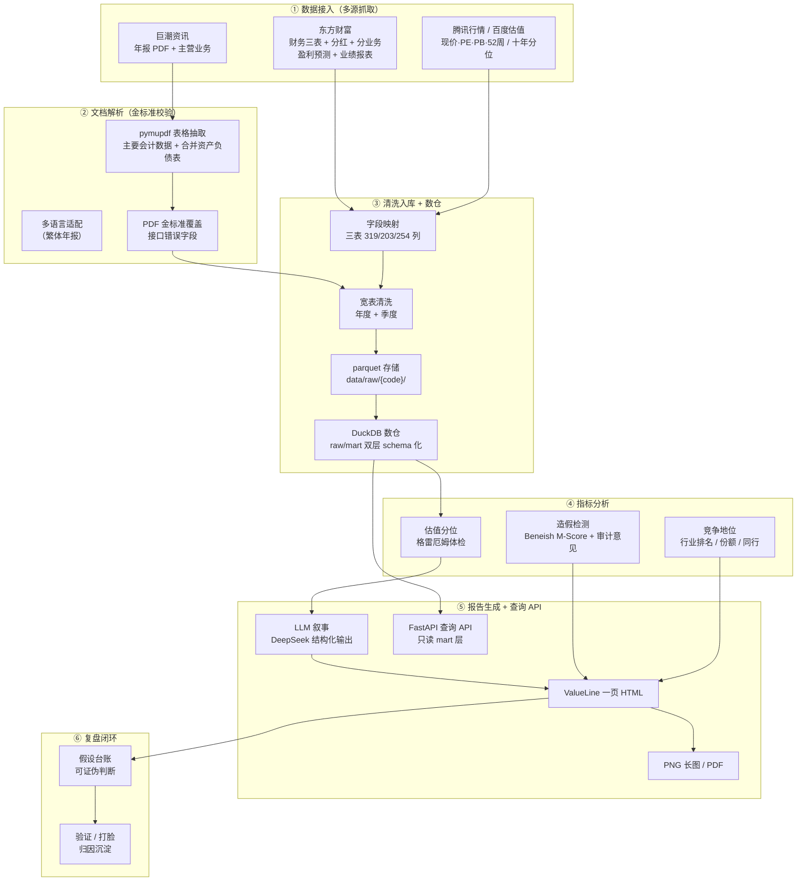

# AI 增强的基本面投研（FQF）

面向 A 股的**价值型投研数据管道**：从多源数据接入、财报文档解析、数据清洗入库、基本面指标分析，到 LLM 驱动的 ValueLine 一页报告与「假设 → 验证/打脸」复盘闭环，全链路自动化。

> 这是一个真实在跑的个人投研系统（非 demo）。核心方法论：格雷厄姆流派（安全边际 / 财务稳健）+ 彼得·林奇六类公司分类。

## 数据管道全链路



## 技术能力清单

| 能力 | 实现 | 状态 |
|------|------|------|
| **多源数据接入** | AKShare 封装东财 / 巨潮 / 腾讯 / 百度，11 类 fetch 接口（财务三表、分红、分业务、估值、行情、机构评级、竞争地位、主营业务） | ✅ |
| **文档解析** | 巨潮年报 PDF + pymupdf `find_tables` 抽取「主要会计数据」「合并资产负债表」，支持繁体多语言；XBRL 公开链路已调研 | ✅ |
| **数据质量校验** | 官方年报 PDF 作金标准，逐字段对比（容差 <0.1%），异常字段自动覆盖；Beneish M-Score + 现金流背离 + 应收背离 + 审计意见（非标一票否决） | ✅ |
| **数仓设计** | DuckDB 列式数仓（raw/mart 双层 schema 化），`warehouse.py` 从 parquet 宽表落库，供分析查询与 API 直读 | ✅ |
| **管道编排** | Airflow 五阶段 DAG（拉取→交叉校验+造假检测→渲染→数仓→导出），Docker Compose 容器化，端到端跑通 | ✅ |
| **LLM 应用层** | DeepSeek 结构化输出（JSON schema 约束），生成商业模式 / 投资逻辑 / 风险 / 林奇分类；铁律「只翻译数据，不编数」 | ✅ |
| **后端服务** | FastAPI 查询 API（7 端点），只读 DuckDB mart 层，参数化查询 + 指标白名单防注入 | ✅ |
| **报告交付** | ValueLine 一页 HTML → PNG @2x 长图 / PDF（Playwright） | ✅ |

## 目录结构

```
.
├── src/
│   ├── data/          # 数据层：fetcher（拉取）/ cleaner（清洗）/ fields（字段映射）/ adapter（宽表→模板）/ storage（入库）/ warehouse（DuckDB 数仓落库）
│   ├── analysis/      # 分析层：fraud（Beneish M-Score + 现金流/应收背离 + 审计意见）
│   ├── report/        # 报告层：llm（DeepSeek 叙事，结构化输出）
│   ├── validation/    # 数据验证：cninfo（巨潮下载）/ pdf_parser（pymupdf）/ validator（金标准交叉校验）/ whitelist
│   ├── api/           # 后端：query（DuckDB 只读查询）/ main（FastAPI 7 端点）
│   └── review/        # 复盘层：ledger（假设台账生命周期）
├── airflow/
│   ├── dags/valueline_pipeline.py  # 五阶段 ETL 编排（拉取→校验→渲染→数仓→导出）
│   ├── docker-compose.yaml         # 容器化运行
│   └── requirements.txt
├── scripts/
│   ├── fetch_stock.py     # 拉取单票数据
│   ├── build_valueline.py # 渲染 ValueLine 一页报告
│   ├── export.py          # HTML → PNG / PDF
│   ├── review.py          # 复盘验证引擎
│   └── journal.py         # 投研日记（内部操作层）
├── templates/valueline.html   # 报告模板（由 build_valueline.py 生成）
├── docs/
│   ├── architecture.md        # 架构设计
│   ├── data-validation.md     # 数据验证设计
│   └── api.md                 # 查询 API 文档
├── data/                      # 本地数据缓存（gitignore，不提交，含 warehouse/fqf.duckdb）
├── reports/                   # 报告归档（按季度）
├── watchlist/                 # 跟踪池 + 假设台账
└── README.md
```

## 快速上手

```bash
# 拉取单票数据（示例：中国神华）
python scripts/fetch_stock.py 601088

# 渲染一页报告（真实数据，无 parquet 时降级示例数据）
python scripts/build_valueline.py 601088

# 导出 PNG 长图 + PDF（首次需装 playwright）
pip install playwright && playwright install chromium
python scripts/export.py templates/valueline.html -o reports/2026Q2 -f png pdf

# 构建 DuckDB 数仓（raw/mart 双层）
python -m src.data.warehouse

# 启动查询 API（读 mart 层，只读）
python -m src.api.main            # http://127.0.0.1:8000/docs 交互式文档
curl "http://127.0.0.1:8000/compare?metric=roe_pct"   # 跨股对比

# Airflow 端到端编排（Docker Compose）
cd airflow && docker compose up -d
```

## 数据可信（本项目护城河）

第三方接口（东财 / 新浪等同源供应商）在「同一控制下企业合并追溯重述」等特殊情形下会抓取错误（如神华 2025 年总资产被报成 9038 亿 vs 官方 6278 亿）。本项目的解法：

1. **金标准**：巨潮官方年报 PDF（文本版），pymupdf 解析。
2. **交叉校验**：接口字段 vs PDF 金标准逐项对比，容差 <0.1%。
3. **自动覆盖**：`reconcile_balance_sheet()` 在渲染前用 PDF 值覆盖异常字段，并在报告「数据校验」区留痕（接口原始值 → 官方值 → 差异率）。
4. **已验证**：2015–2025 共 10 年、70 项对比全部一致（神华）；含真实非标案例（*ST 皇庭「无法表示意见」、万科「带强调事项段」）交叉验证审计意见分级。

## Roadmap

| 阶段 | 内容 | 状态 |
|------|------|------|
| P0 | ValueLine 一页模板 + 导图 | ✅ |
| P1 | 数据层：多源接入 + 文档解析 + 清洗入库 + 数据验证 + Airflow 调度 | ✅（剩：全市场批量拉取） |
| P2 | 分析层：估值分位 / 格雷厄姆体检 / 造假检测 / 竞争地位 | ✅ |
| P3 | 报告层：数据绑定 + LLM 叙事 + 机构评级 + 业务版图 + DuckDB 数仓 + FastAPI 查询 API | ✅（剩：季度更新引擎） |
| P4 | 产品层：小程序 + 内容发布 | ⬜ |

## 合规铁律

- **公开版完全去操作**：不出现价格点位、仓位、目标价、买卖建议。
- 操作层（敢接价 / 挂单）只进内部投研日记（`journal/`，已 gitignore），不进公开产物。
- 52 周价、机构评级、预测 EPS 均标注「第三方机构观点，非本人建议」。
- 每页附数据校验记录（来源 / 口径 / 校验日期 / 校验人）与免责声明。
